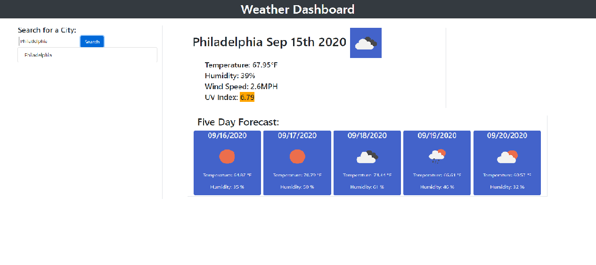

# Weather-Dashboard

For this assignment I was tasked with making a working weather application.  This application consists of a search bar triggered by a search button, to pull up weather information on the selected City from the user.  

To do this I pulled data from OpenWeather API, using multiple API databases to gather the information needed to complete this application.  

Once pulled, I placed the current day forecast on the top of the page and have icons representing the weather as well as a UV index that changes color based on the index rating.

I also pulled up the information on the five day forecast and placed that information below.

Once the user searches a city, that city is then added to the search bar history creating a button to be viewed again.

This task beared its challenges as the first application using API's to gather my data that would dynamically appear on the page based on user input.  I found it even more intricate when I needed to take information found in one API search to input into a second API search to gather the data I needed.

All in all, it was a fun project.  Enjoy!

Link to application: https://rseckman.github.io/Weather-Dashboard/